# ArrayList

## ArrayList的基础特点
	1. Resizable-array
	2. permits all elements, including null
	3. unsynchronized vs  Vector
	4. adding n elements requires O(n) time
	5. it is always at least as large as the list size.  As elements are added to an ArrayList, its capacity grows automatically.*

- ArrayList 的类关系?
## Capacity
1. ArrayList 的几种构造函数对 ArrayList容量的影响? 传入集合的构造函数的实现?
	1. 默认构造函数
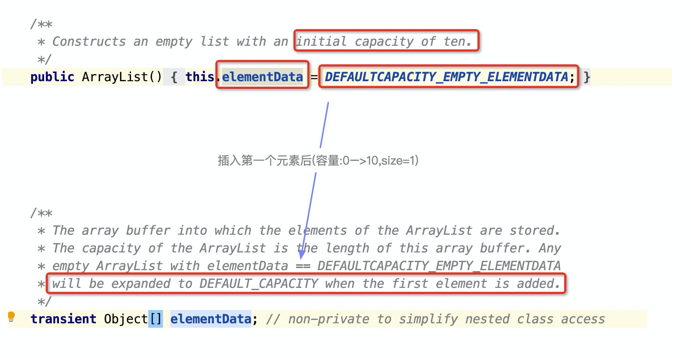
	2. 构造函数,带初始容器initialCapacity参数
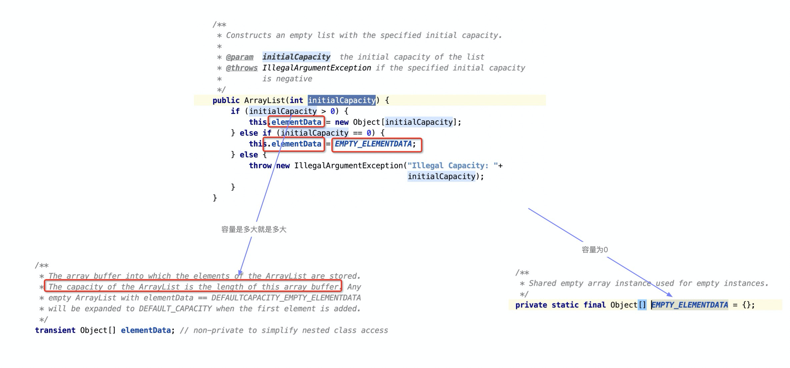
- 通过上面的比较,`DEFAULTCAPACITY_EMPTY_ELEMENTDATA ` 和`EMPTY_ELEMENTDATA` ,**前者知道扩容的容量是10**
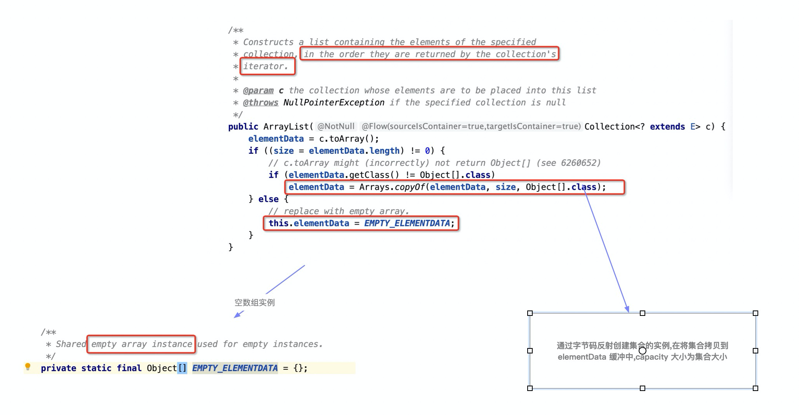

2. 几种控制ArrayList 容量的方法?
	- 如何缩容?这个方法可以直观的说明 ::size<= capacity:: ,将容量缩减至当前的size 大小
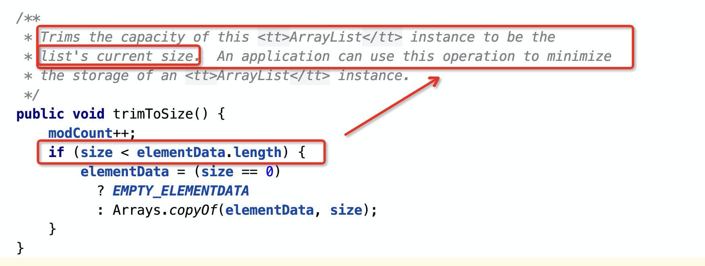
	- 如何扩容?(第一种:目标容量从外部传入,即调用方指定目标容量)
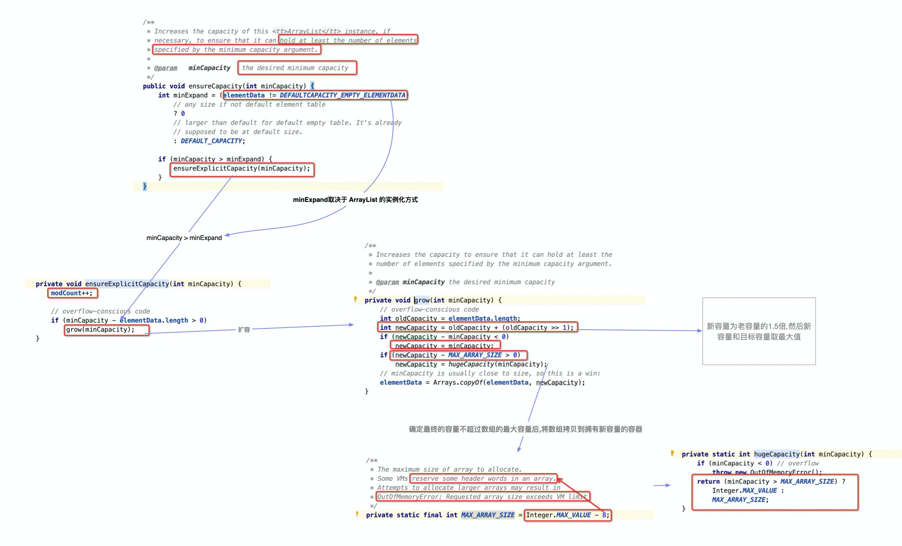
	- 如何扩容?(第二种:目标容量从外部传入,即调用方指定目标容量)
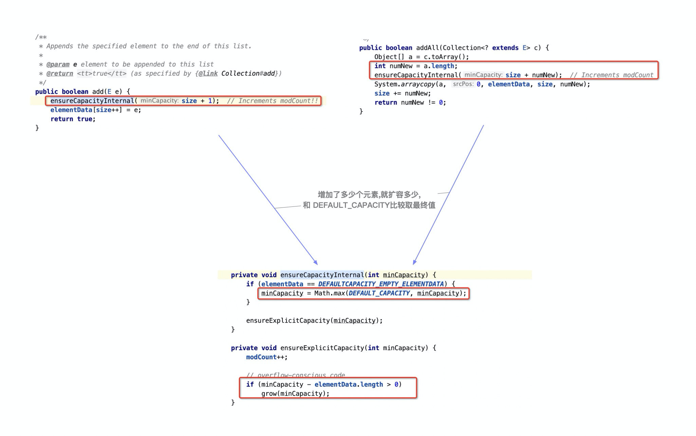

## modCount
1. modCount的表达的意义(什么是 structurally modified)?用途和如何使用?
	- 意义
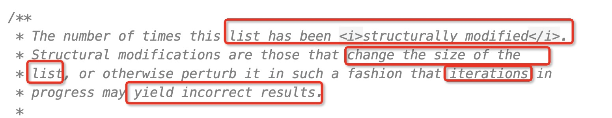
	- 用途(什么是 fail-fast behavior)和如何使用(关键看子类方法是否要提供 fail-fast 功能)
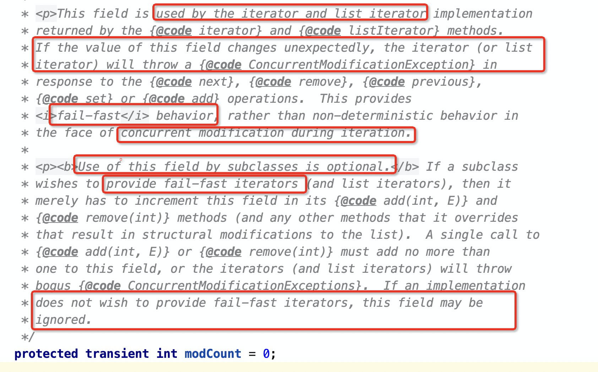

2. ArrayList  中哪些方法会导致集合structurally modified(需要modCount++)?
> sort,replaceAll等其他方法同样同样分析  
	-  在增加元素的时候modCount++,因为都要调扩容方法,modCount++写在扩容方法里
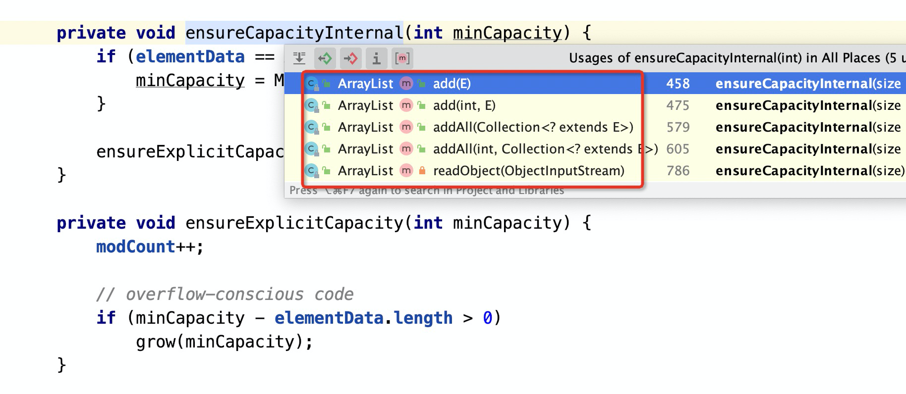
	- 除了增删改,sort方法为什么也会导致(structurally modified.需要modCount++) ?
		- 为什么校验 modCount 值?
			- sort排序的过程也要迭代元素,比如最后**modCount**发生了改变,你的排序是不准确的,要抛出并发修改异常
		- 这里 sort 用的是**归并排序**
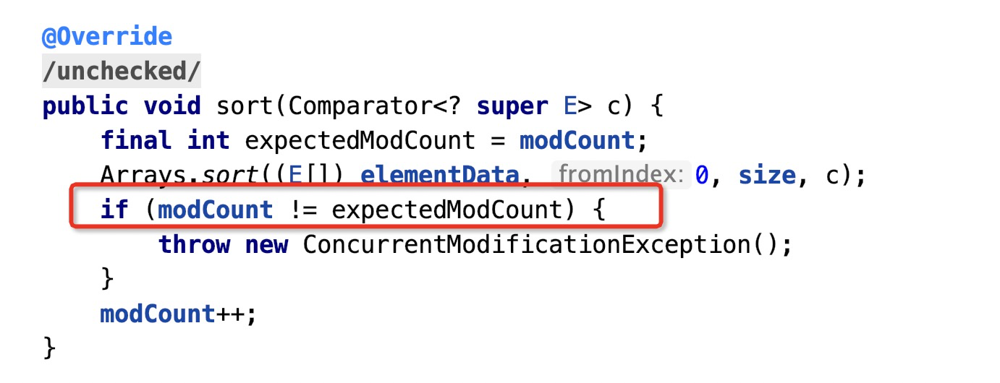
		- 排序虽然不会增删元素,但是可能会将(2,3,1)—>(1,2,3),集合发生了结构性改变;而且,这时候如果有其它方法校验集合的第一个元素就发现了2变成了1,如果不让 modCount++.其它方法就没办法发现这种改变,造成不可预期的错误
		
	- 注意:对增删来讲没增删一个元素 modCount++,所以批量删除方法这样写的
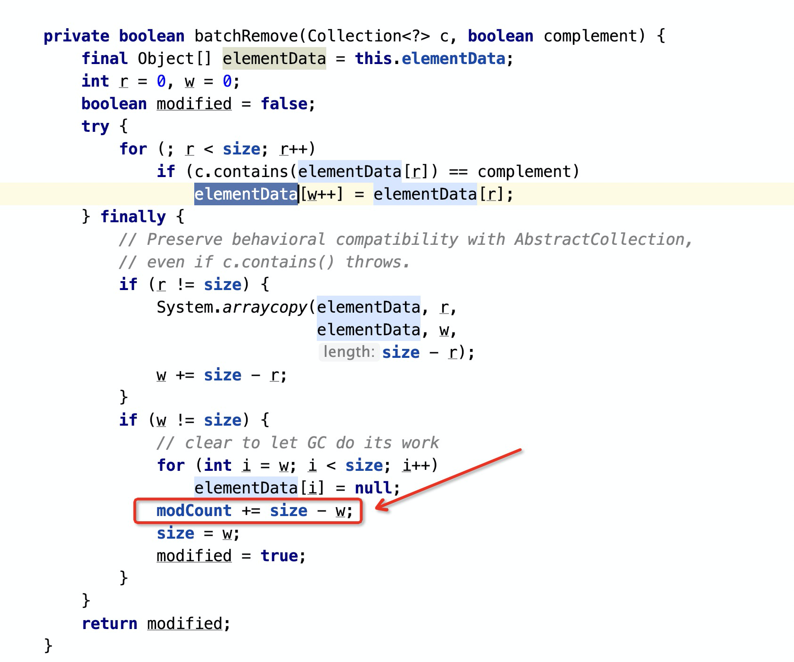
	

## batchRemove方法
1. removeAll(Collection<?> c),retainAll(Collection<?> c)
怎么实现的?
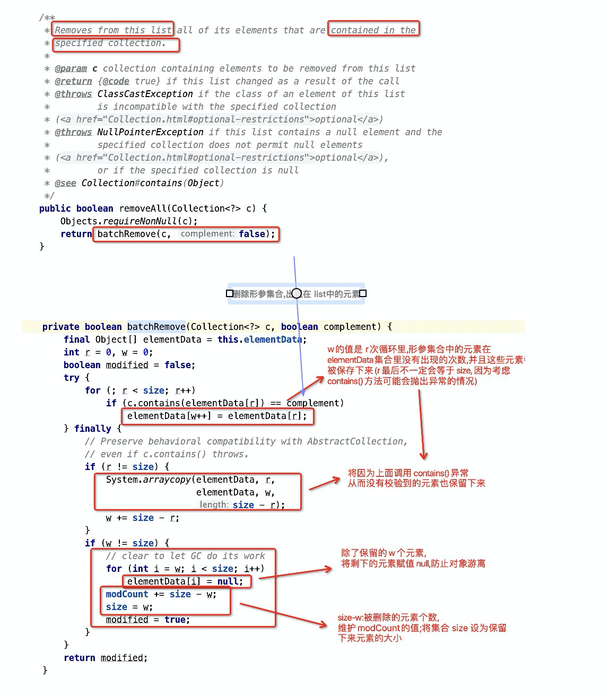
- contains(Object o) 什么时候抛出异常
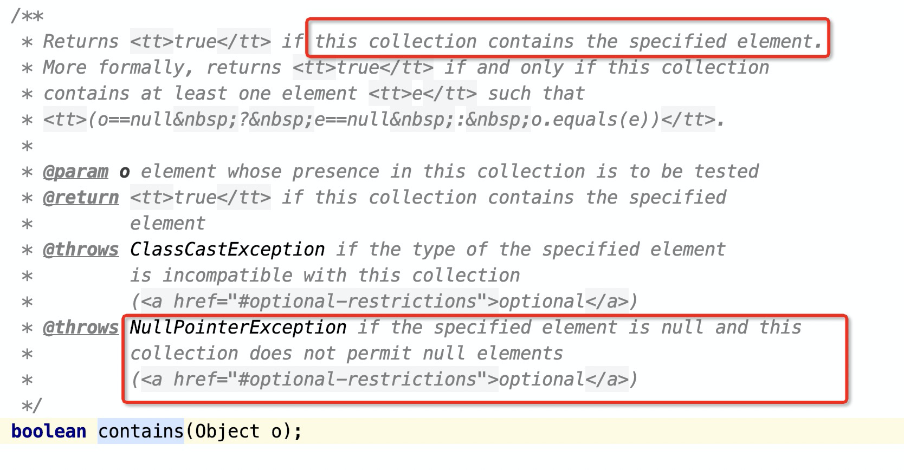

## ArrayList 的迭代器ListItr,Itr和Iterator
1. ListItr,ListIterator.Itr和Iterator之间的关系?
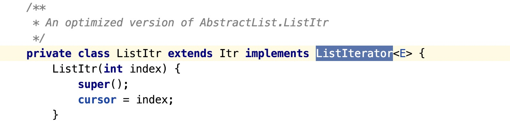
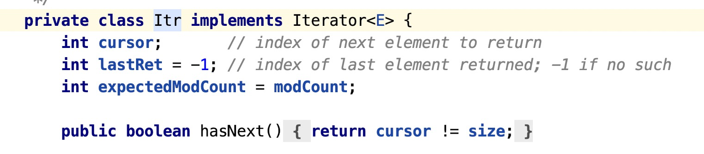
2. ListItr迭代器拥有的3个属性的含义?
	1. int cursor**;       *// index of next element to return*
	2. int lastRet**= -1; *// index of last element returned; -1 if no such*
	3. int expectedModCount= modCount;  (校验容器是否被并发修改)
3. 迭代器的构造函数的作用?
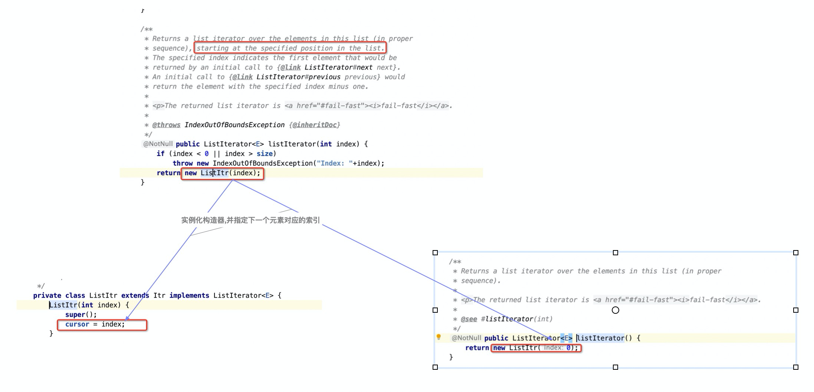

4. ListItr迭代器在父类 Itr 迭代器的基础上新增的 previous()方法实现?新增 add,set 方法的特点,以及和 ArrayList中的 add,set 的区别?
> 关键点是怎么维护cursor,lastRet两个字段  
	- add是加在 cursor 指向的索引位置,因为不返回任何元素,**lastRet= -1**;但是还可以接着加元素,所以**cursor+1**
	- set是更新lastRet位置的元素,并返回旧值
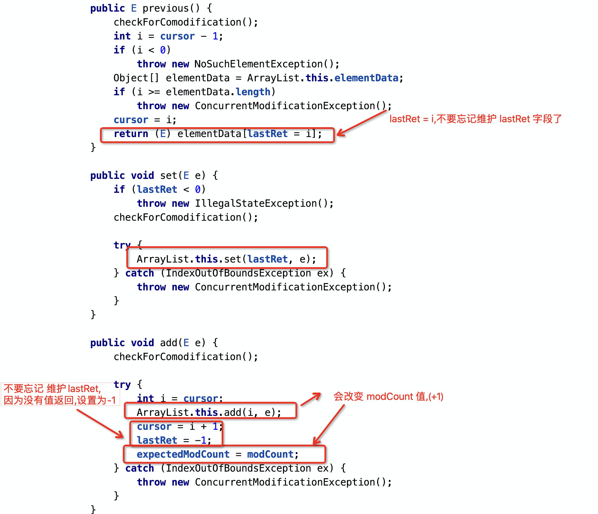

## SubList
1. 为什么要在 ArrayList 里搞一个内部类数据结构 SubList?
	- 这里面主要是视图思想,同一个数据源可以提供多个不同的视图对象(提供需要的数据,隐藏不需要的数据,安全又方便)
	- 感觉在 JDK8后这些就被流取代了,Stream流更适合做这些, SubList毕竟还是数据结构

## Java8引入函数式接口带来的改变
	1. [[Spliterator]] <-----待补充

1. `transient Object[] elementData;`
的作用?为什么用 transient 修饰?
2. fail-fast behavior of an iterator? fail-fast机制带来的问题?

