# HashMap
[HashMap源码之resize方法 - 简书](https://www.jianshu.com/p/4fc089ca25dd)
[JDK 1.8 中 HashMap 扩容 - 算法网](http://ddrv.cn/a/234367)
[hash()、tableSizeFor()()](https://blog.csdn.net/fan2012huan/article/details/51097331)
## HashMap的基础特点
	1. permits null values and the null key
	2.  unsynchronized and permits nulls (vs Hashtable)
	3. makes no guarantees as to the order of the   map
	4. **initial capacity**  and **load factor**affect its performance
	5. not synchronized

## 基本数据结构和接口
	1. 什么是 Map 中的 Entry接口,Entry 表达的含义支持什么操作以及如何获取一个Map 的引用?
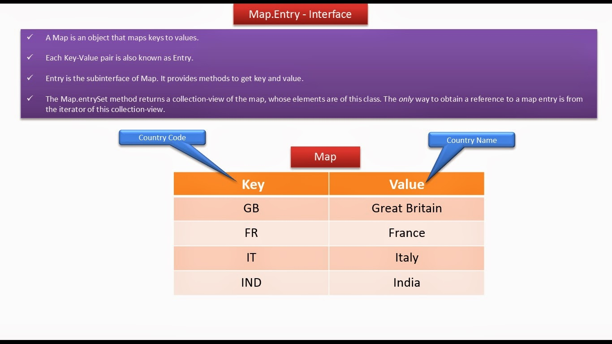
- 获取集合视图,有了集合就可以使用集合的迭代器迭代
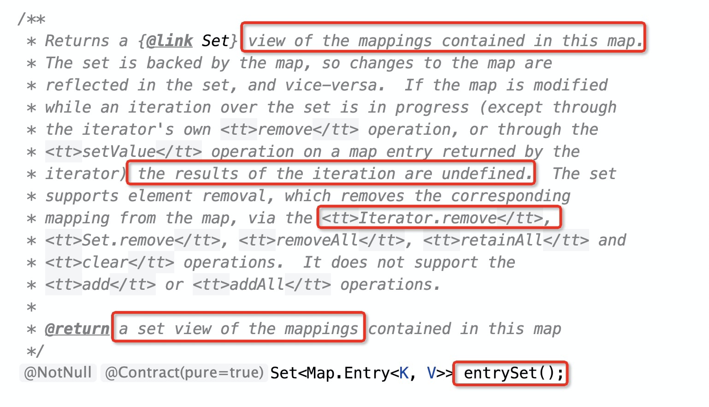

	2. HashMap 中的静态内部类Node<K,V>的数据结构是怎样的?
		- 递归的数据结构(链表)
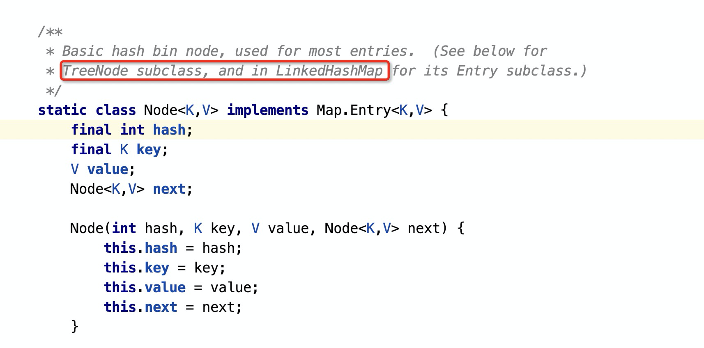 
	3. HashMap 中的内部类KeySet的数据结构是怎样的,和其它AbstractCollection 的实现类相比较提供了什么特点,这些特点来自于哪里?
		- 继承 AbstractSet抽象类—> 继承自AbstractCollection抽线累
		- KeySet对AbstractCollection中的抽象方法提供了实现(AbstractSet没有实现剩下的方法),并添加了额外的方法Spliterator<K> spliterator()
		- 总结KeySet的特点来自于这几方面
			1. AbstractSet提供的hashCode,equals,removeAll实现方法
			2. KeySet自己提供的获取并发迭代器Spliterator的方法
			3. KeySet实现的AbstractCollection中的抽象方法,比如获取迭代器实现,返回的是KeyIterator迭代器,remove,forEachss方法也是由 KeySet 自己实现,其它剩下的抽线方法实现size,clear,contains 直接调用的外部类 HashMap 的实现(这也是内部类的好处,持有外部类的引用)
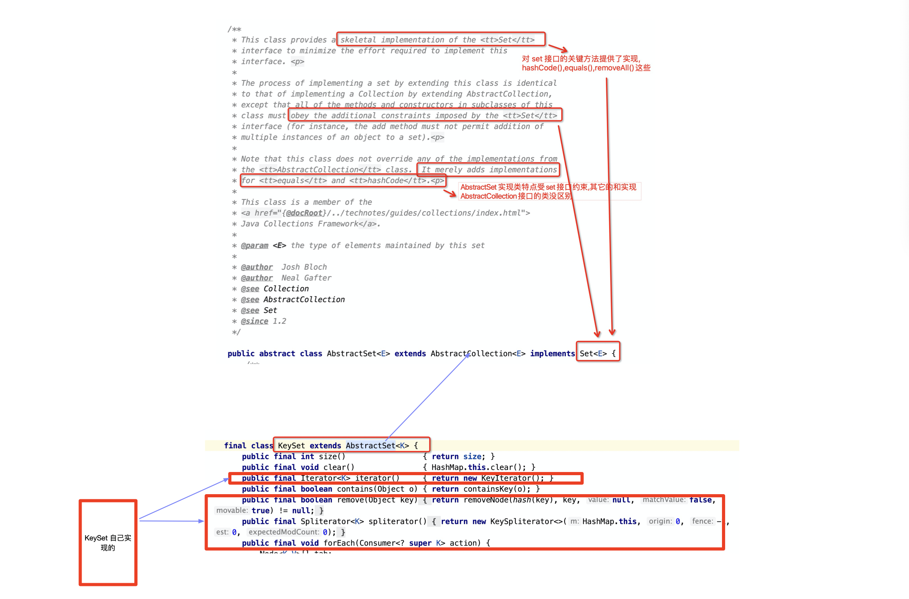
	4. HashMap中的内部类数据结构,除了 KeySet 这一种 HashMap 返回的集合视图对象,还有Values,EntrySet这两种内部类数据结构(集合视图对象),它们之间的实现有哪些异同?
		-  这3种集合视图对象能获取的迭代器不同,迭代的细节不同
		- 当然 remove()移除,contains()校验包含 的对象也不同
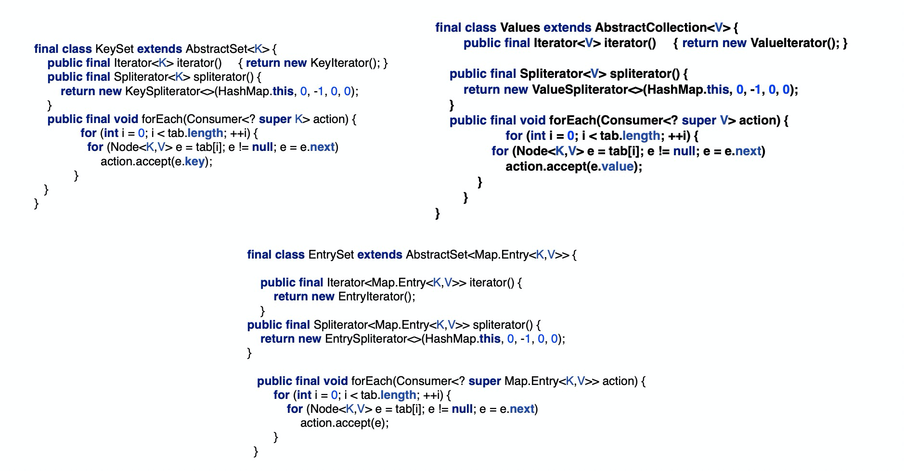
	5. HashMap中抽象类HashIterator的数据结构是怎样的,各成员变量的含义?它提供的实现和特点?
		- HashIterator提供了 HashMap 中3种具体的迭代器的一些共性(作为它们的父类)
		- **next将表示第一个非空桶中的第一个结点，index将表示下一个桶**。
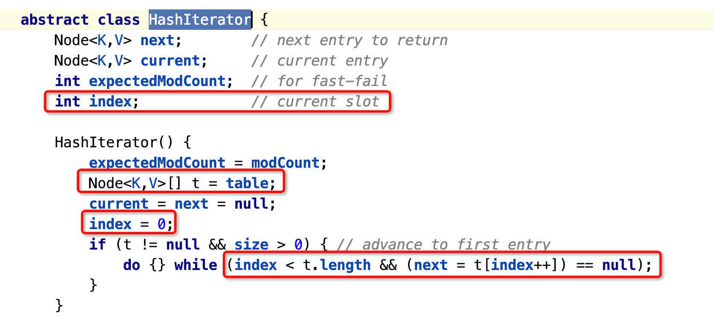
		- HashIterator 中nextNode()方法的实现?
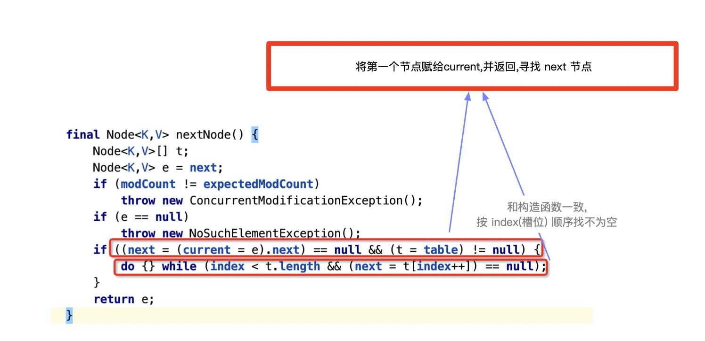

	6. KeyIterator,ValueIterator,EntryIterator3种迭代器数据结构是怎样的?
		-  从这三个迭代器来看,HashMap可以提供三种集合视图对象,而3种不同的迭代器在迭代时返回 Node<k,v>不同的部分
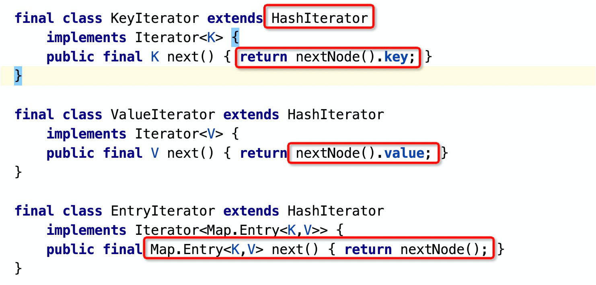

	7. HashMapSpliterator,KeySpliterator,ValueSpliterator,EntrySpliterator 待补充

## 关键的属性(成员变量)
	1. 什么是 HashMap 的loadFactor,initialCapacity,threshold?他们的作用和互相关系?
		- threshold: HashMap进行扩容的阈值，它的值等于 HashMap 的容量乘以负载因子,The next size value at which to resize (capacity *load factor).
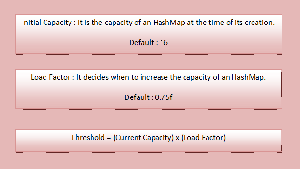

	2.  什么是 HashMap中的transient Node<K,V>[]  table?
		- The table, initialized on first use, and resized as necessary. When allocated, length is always a power of two.
		- **HashMap的底层实现仍是数组,只是数组的每一项都是一条链表(初始化时)**

	3. HashMap 中 TREEIFY_THRESHOLD ,UNTREEIFY_THRESHOLD和MIN_TREEIFY_CAPACITY的作用?
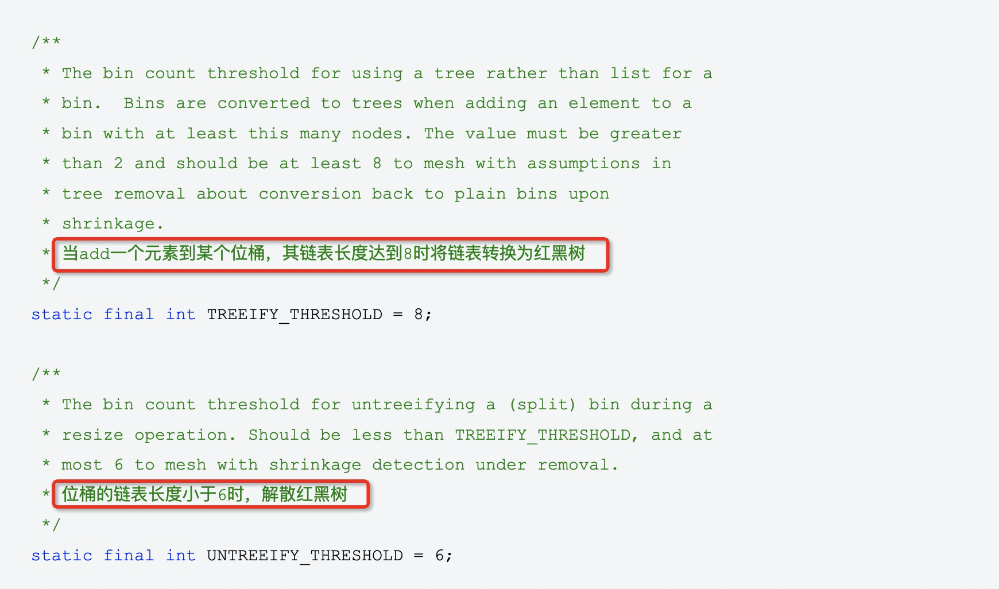
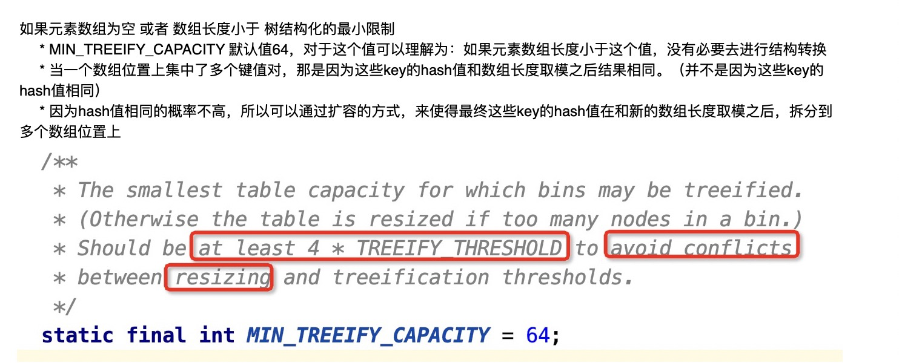

## 关键方法
### hash()、tableSizeFor()方法
1. 为什么要有HashMap的hash()方法，难道不能直接使用KV中K原有的hash值吗？在HashMap的put、get操作时为什么不能直接使用K中原有的hash值?
	- 注意:0101这个第四位就是由高位>>>16产生的,这样高位就参与计算了,减少了碰撞
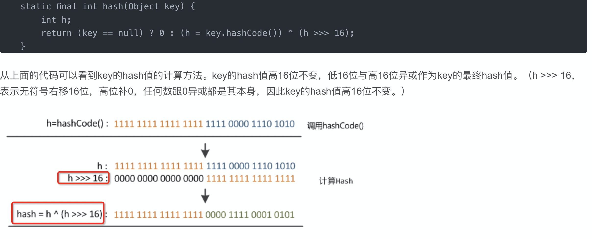
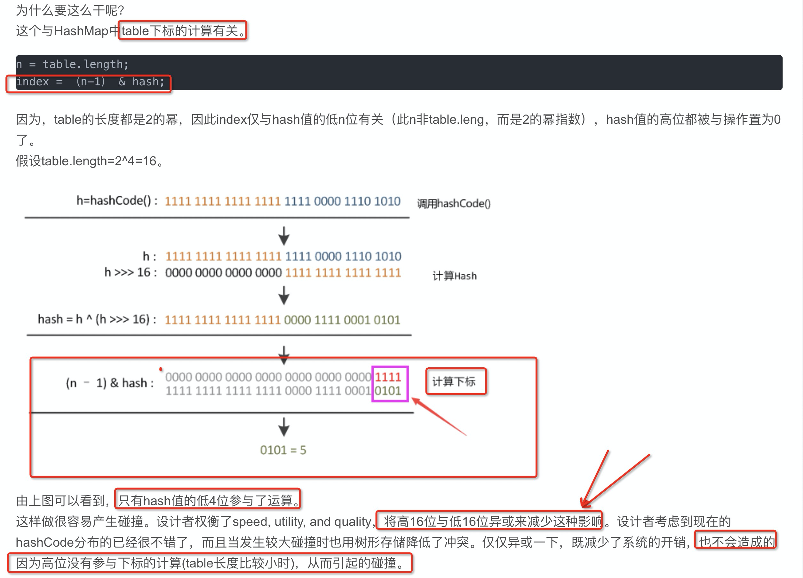
2. HashMap 中tableSizeFor()方法的作用和算法实现的过程?
	- 作用: 在实例化HashMap实例时，如果给定了initialCapacity，由于HashMap的capacity都是2的幂，因此这个方法用于找到大于等于initialCapacity的最小的2的幂（initialCapacity如果就是2的幂，则返回的还是这个数）。
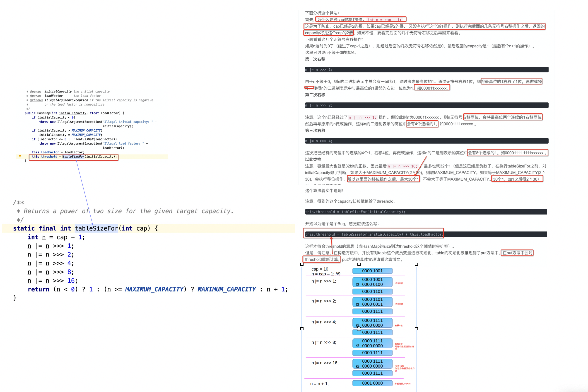

### resize方法
1. 哪两种情况(具体是3种情况)会调用resize()方法,resize()后的容量分别表现怎样?
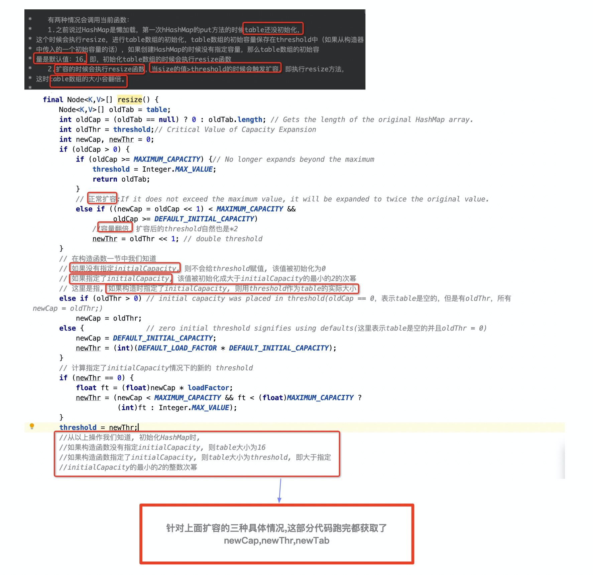

2. HashMap 中resize 时候,如何完成oldTab中Node迁移到table(newTab)中去可能遇到哪三种情况,分别如何实现的?

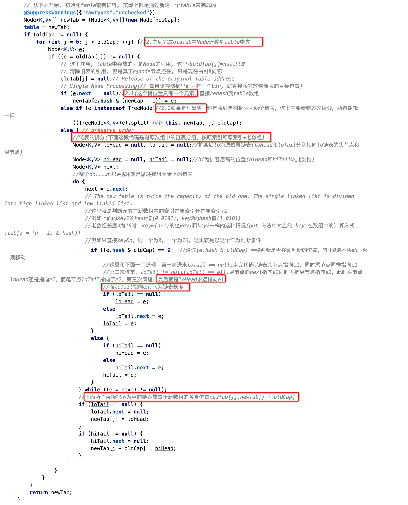
- 链表扩容示意图

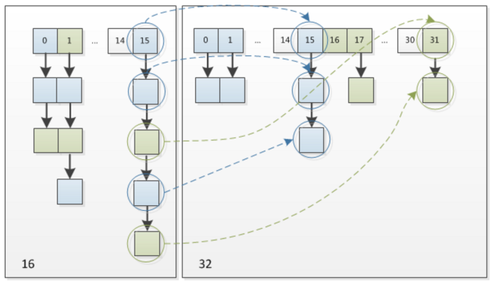
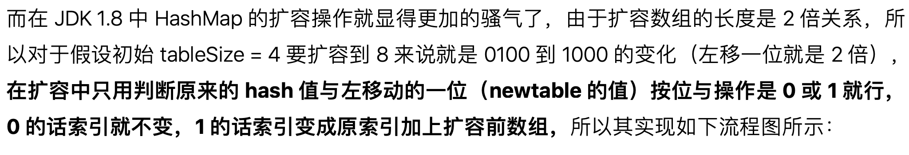
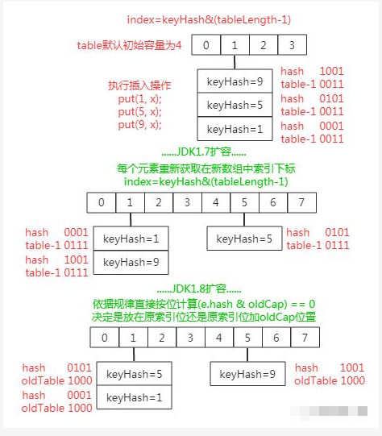

### put 方法
	1. HashMap 中 put 方法的执行逻辑?
	2. HashMap 中 put 方法中的如何插入数组的索引位置对应存在红黑树了,*红黑树的插入操作是怎样的,即putTreeVal方法执行过程?

## 获取 HashMap 内部的数据结构的实例

## HashCode 方法
## HashMap的性能
	1. 影响HashMap的性能的两个因素?
	2. 为什么the default load factor 设置为 (.75)?
	3. HashMap如何扩容?

## TREEIFY(树化)
	1. 树化相关的属性?
	2. TREEIFY和UNTREEIFY的时机和过程?

## fail-fast机制和安全性
通过 ABC 三个线程具体说明(ABC 之间相互依赖的情况)
	1. the fail-fast behavior of iterators should be used only to detect bugs

## 其它
	- 为什么需要 Node<K,V>[] tab,不直接访问table

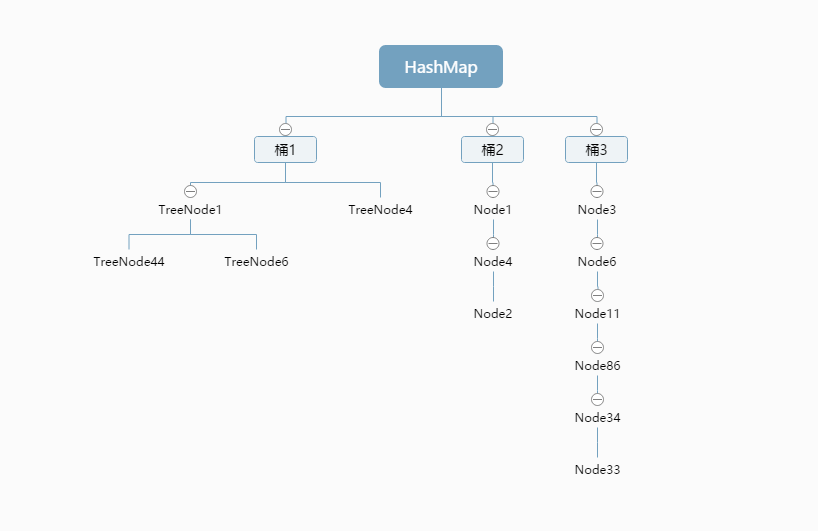
## 1.7vs1.8
	- 1.7,1.8HashMap 扩容的对比?
		- 待补充