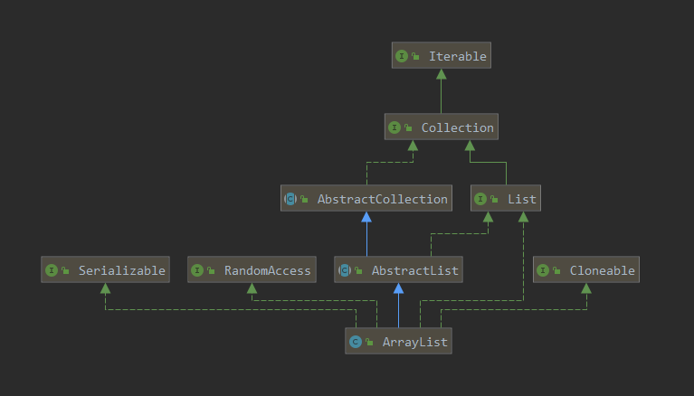
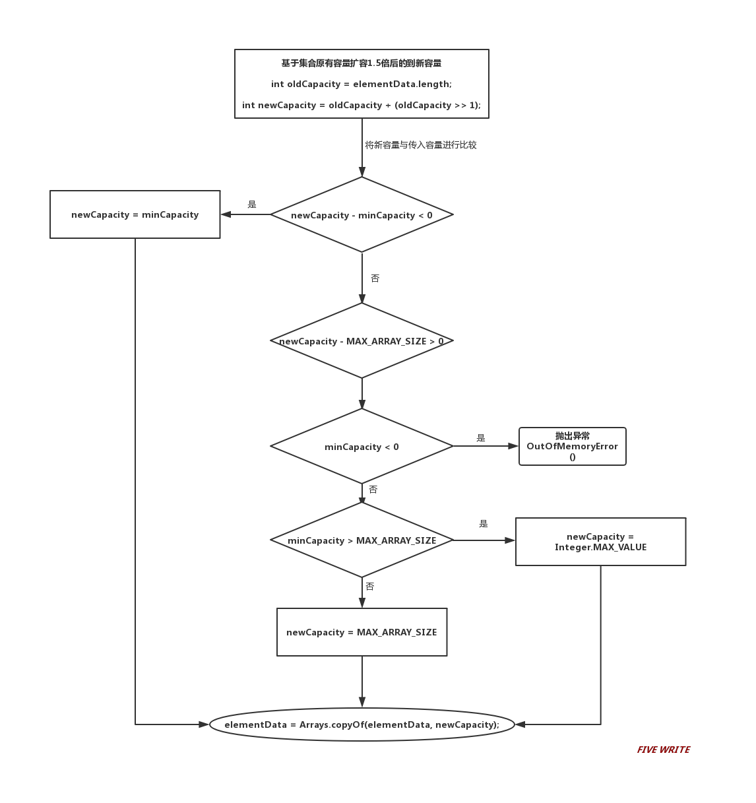

[TOC]

- *本文对于`ArrayList`的源码阅读记录基于`JDK1.8`，个人浅见，如有不妥，敬请指正。*
- *文中 "`//TODO`"处代表个人暂时未懂或标示之后会学习的地方，如有高见，敬请指教。*

# 1.ArrayList底层原理

## 1.1 ArrayList的UML



```java
public class ArrayList<E> extends AbstractList<E>
        implements List<E>, RandomAccess, Cloneable, java.io.Serializable{...｝
```

- 继承了AbstractList；
- 实现了List接口；
- 实现了RandomAccess接口，支持快速随机访问，通过下标序号进行快速访问；
- 实现了Cloneable接口，支持克隆；
- 实现了Serializable接口，支持序列化；

## 1.2 ArrayList的数据结构

```java
/**
 * Resizable-array implementation of the <tt>List</tt> interface.  Implements
 * all optional list operations, and permits all elements, including
 * <tt>null</tt>. 
```

​		如上，通过ArrayList的源码文档可知，ArrayList是可动态调整容量的数组(`Resizable-array`)，ArrayList实现了List的所有操作并允许包括null在内的所有元素（ArrayList中存放的是Object[]数组，意味着ArrayList可以存放任何继承自Object的对象）。

## 1.3 ArrayList中定义的常量、变量以及构造函数

```java
	//序列版本号
	private static final long serialVersionUID = 8683452581122892189L;

    /**
     * 默认初始化容量
     */
    private static final int DEFAULT_CAPACITY = 10;

    /**
     * 用于空实例的共享空数组实例。
     */
    private static final Object[] EMPTY_ELEMENTDATA = {};

    /**
     * JDK 1.8中添加的，也是一个空数组，与EMPTY_ELEMENTDATA区分开来
     * （当调用无参构造方法时默认复制这个空数组）
     */
    private static final Object[] DEFAULTCAPACITY_EMPTY_ELEMENTDATA = {};

    /**
     * 保存添加到数组中的元素；
     * elementData是一个动态数组；
     * 通过public ArrayList(int initialCapacity){}构造函数时elementData=initialCapacity;
     * 通过public ArrayList(){}构造函数时elementData=DEFAULT_CAPACITY=10;
     */
    transient Object[] elementData; // 非私有以简化嵌套类访问

    /**
     * 数组中元素的大小
     *
     * @serial
     */
    private int size;

 	/**
     * 指定初始化容量大小的构造函数
     *
     * @param  initialCapacity  数组的初始化容量大小
     * @throws IllegalArgumentException 输入参数为负数时抛出异常
     */
    public ArrayList(int initialCapacity) {
        if (initialCapacity > 0) {
            this.elementData = new Object[initialCapacity];
        } else if (initialCapacity == 0) {
            this.elementData = EMPTY_ELEMENTDATA;
        } else {
            throw new IllegalArgumentException("Illegal Capacity: "+
                                               initialCapacity);
        }
    }

    /**
     * 无参构造函数构造，初始化容量为0
     */
    public ArrayList() {
        this.elementData = DEFAULTCAPACITY_EMPTY_ELEMENTDATA;
    }

    /**
     * 构造一个包含指定集合的元素的列表，其顺序由集合的迭代器返回
     *
     * @param c 将其元素放入此列表的集合
     * @throws NullPointerException 传入集合参数为null时抛出异常
     */
    public ArrayList(Collection<? extends E> c) {
        elementData = c.toArray();
        if ((size = elementData.length) != 0) {
            // c.toArray might (incorrectly) not return Object[] (see 6260652)
            if (elementData.getClass() != Object[].class)
                elementData = Arrays.copyOf(elementData, size, Object[].class);
        } else {
            // replace with empty array.
            this.elementData = EMPTY_ELEMENTDATA;
        }
    }

	/**
     * 数组最大容量限定；
     * 预留容量空间，避免内存溢出；为什么要预留？后面会说
     */
    private static final int MAX_ARRAY_SIZE = Integer.MAX_VALUE - 8;
```

### 1.3.1 ArrayList的默认容量是多少？

```java
 	private static final Object[] DEFAULTCAPACITY_EMPTY_ELEMENTDATA = {};

	public ArrayList() {
        this.elementData = DEFAULTCAPACITY_EMPTY_ELEMENTDATA;
    }
```

​		通过ArrayList的无参构造函数可以看出，初始化时ArrayList的默认容量是一个空数组，相当于默认容量为0；

注：JDK1.8之前默认容量是10.

### 1.3.2 elementData为什么要用transient修饰？

​		首先说一下transient关键字：Java的serialization提供了一种持久化对象的机制，当持久化对象时，可能有一个特殊的对象数据成员，不想用serialization机制来保存，为了在一个特定对象的一个域上关闭serialization，可以在这个域前加上关键字transient。当一个对象被序列化时，transient型变量的值不包括在序列化的表示中，非transient型的变量是被包括进去的。（HashMap、ArrayList中都使用了transient关键字）

- transient修饰的变量不能被序列化；

- transient只作用于实现 Serializable 接口；

- transient只能用来修饰普通成员变量字段；

- 不管有没有 transient 修饰，静态变量都不能被序列化；

​	ArrayList是可序列化的类，elementdata是ArrayList用来存储元素的成员，用transient关键字修饰elementdata，真的就意味着elementdata不能序列化了吗？而且这样反序列化后的ArrayList也会把原来存储的元素弄丢？

   如果继续看ArrayList的源码，会发现ArrayList会调用自己实现的writeObject()和readObject()方法进行序列化和反序列化，之所以这样，是因为elementdata是一个缓存数组，通常会预留一些容量，等到容量不足时再扩容，这些预留的容量空间里没有实际存储元素。所以采用transient关键字保证elementdata不会被serialization提供的持久化机制保存（序列化），再加上ArrayList自己实现的序列化和反序列方法，这样就可以保证ArrayList序列化时只会序列化实际存储的那些元素，而不包含预留容量中空的存储空间，从而节省序列化反序列化的时间和空间。

参考：[ArrayList中elementData为什么被transient修饰？](https://blog.csdn.net/zero__007/article/details/52166306)

### 1.3.3 DEFAULTCAPACITY_EMPTY_ELEMENTDATA和EMPTY_ELEMENTDATA的区别？

//TODO

### 1.3.4 ArrayList三种构造函数

1.无参构造函数：无参构造函数时，创建一个容量为0的数组；

```java
    public ArrayList() {
        this.elementData = DEFAULTCAPACITY_EMPTY_ELEMENTDATA;
    }
```

```java
        ArrayList arrayList = new ArrayList();
```

2.指定容量构造函数

```java
    public ArrayList(int initialCapacity) {
        if (initialCapacity > 0) {
            this.elementData = new Object[initialCapacity];
        } else if (initialCapacity == 0) {
            this.elementData = EMPTY_ELEMENTDATA;
        } else {
            throw new IllegalArgumentException("Illegal Capacity: "+
                                               initialCapacity);
        }
    }
```

```
        ArrayList arrayList = new ArrayList(20);
```

- `initialCapacity > 0`时，ArrayList容量为给定的`initialCapacity`；
- `initialCapacity == 0` 时，ArrayList容量为`EMPTY_ELEMENTDATA = 0`；
- `initialCapacity < 0` 时，抛出异常：`"Illegal Capacity: "+ initialCapacity`；

3.构造一个包含指定集合的元素的列表，按集合的迭代器返回元素的顺序排列。

```java
public ArrayList(Collection<? extends E> c) {
        elementData = c.toArray();
        if ((size = elementData.length) != 0) {
            // c.toArray might (incorrectly) not return Object[] (see 6260652)
            if (elementData.getClass() != Object[].class)
                elementData = Arrays.copyOf(elementData, size, Object[].class);
        } else {
            // replace with empty array.
            this.elementData = EMPTY_ELEMENTDATA;
        }
    }
```

```
        ArrayList arrayList = new ArrayList(Arrays.asList(new String[]{"1","2","3"}));
```

1. 将传入集合`c`拷贝给`elementData`。

```java
        elementData = c.toArray();
        			|
        			↓
        根据toArray()进入Arrays查看该方法源码
        @Override
        public Object[] toArray() {
            return a.clone();
        }
```

​	  2. 对得到 `c` 拷贝后的`elementData`进行判断：

​			2.1传入集合为空时：指定ArrayList容量为`EMPTY_ELEMENTDATA = 0`；

​			2.2传入集合不为空时且类型与Object[]不相同时，进行一次`Arrays.copyOf()`，将源数组中的元素类型向上转型后将复制的新数组返回给elementData；

### 1.3.5 ArrayList为什么规定MAX_ARRAY_SIZE = Integer.MAX_VALUE - 8 ?

```java
    /**
     * The maximum size of array to allocate.
     * Some VMs reserve some header words in an array.
     * Attempts to allocate larger arrays may result in
     * OutOfMemoryError: Requested array size exceeds VM limit
     */
    private static final int MAX_ARRAY_SIZE = Integer.MAX_VALUE - 8;
```

​		数组对象也是标准的JAVA对象，在JVM（HotSpot）的堆内存中的实际存储方式和格式也满足oop-class二分模型。之所以`MAX_ARRAY_SIZE = Integer.MAX_VALUE - 8` 是因为需要预留一定长度来保存对象元数据的信息，在ArrayList中预留的8字节是用来存储数组长度，因为ArrayList不能计算自己的长度。

​		那为什么是`Integer.MAX_VALUE - 8`呢？是因为JVM要求对象的大小必须是8字节的整数倍，因此当“对象头+实例数据”大小不满足8字节的整数倍时，就需要补齐满足前述条件。

> “
>
> 按照8字节对齐，是底层CPU数据总线读取内存数据的要求。
>
> 通常CPU按照字长来读取数据，一个数据若不对齐则可能需要CPU读取两次；
>
> 若进行了对齐，则一次性即可读出目标数据，这将会大大节省CPU资源，因此对象大小需要补齐。
>
> ”

//TODO *JAVA对象在堆内存中的详情？*

参考：

- [Why the maximum array size of ArrayList is Integer.MAX_VALUE - 8?](https://stackoverflow.com/questions/35756277/why-the-maximum-array-size-of-arraylist-is-integer-max-value-8)
- [如何计算Java对象占堆内存中的大小 ](http://www.sohu.com/a/306845134_505779)

# 2.ArrayList如何添加元素？

​		向ArrayList中添加元素，在所难免会涉及到ArrayList扩容的情况，在记录添加元素方法前先看看ArrayList的扩容机制。

## 2.1 ArrayList的扩容机制？

#### 2.1.1 初始判断扩容

```java
    /**
    * 比较传入容量的大小
    * 这个方法只有在首次调用时会用到
    **/
	private static int calculateCapacity(Object[] elementData, int minCapacity) {
        // 判断ArrayList是否刚初始化
        if (elementData == DEFAULTCAPACITY_EMPTY_ELEMENTDATA) {
            return Math.max(DEFAULT_CAPACITY, minCapacity);
        }
        return minCapacity;
    }
	// 校验容量的大小
    private void ensureCapacityInternal(int minCapacity) {
        ensureExplicitCapacity(calculateCapacity(elementData, minCapacity));
    }

    private void ensureExplicitCapacity(int minCapacity) {
        modCount++;//记录修改，modCount的作用是在List迭代器遍历时用作线程安全检查

        // 如果传入的值大于初始长度，则调用grow()方法进行扩容
        if (minCapacity - elementData.length > 0)
            grow(minCapacity);
    }
```

- 初始化判断会判断ArrayList是否刚初始化，如果成立，则将ArrayList扩容为默认容量`DEFAULT_CAPACITY = 10`；
- 若判断 `minCapacity` 和 `DEFAULT_CAPACITY` 的大小，在二者的最大值内还有可用空间，则取二者中的最大值为ArrayList的容量；
- 当`minCapacity` 和`DEFAULT_CAPACITY`的最大值容量都没有可用空间了，则调用`grow()`进行扩容；

#### 2.1.2 调用`grow()`扩容

```java
	/**
     * 对列表进行扩容，以确保它至少可以容纳最小容量参数指定的元素。
     *
     * @param minCapacity 传入所需的最小容量
     */
    private void grow(int minCapacity) {
        // 记录原容量的大小
        int oldCapacity = elementData.length;
        // 设置新容量，新容量大小为原容量的1.5倍（右移一位就是1/2）
        int newCapacity = oldCapacity + (oldCapacity >> 1);
        // 判断新容量是否满足需求,若扩容后仍不够用，将传入最小容量大小复制给新容量
        if (newCapacity - minCapacity < 0)
            newCapacity = minCapacity;
        // 判断新容量是否超出最大长度限制,如果超出，进入hugeCapacity()处理
        if (newCapacity - MAX_ARRAY_SIZE > 0)
            newCapacity = hugeCapacity(minCapacity);
        // 将原数组的数据复制至新数组， ArrayList的底层数组引用指向新数组
        elementData = Arrays.copyOf(elementData, newCapacity);
    }

    private static int hugeCapacity(int minCapacity) {
        if (minCapacity < 0) // overflow
            throw new OutOfMemoryError();
        return (minCapacity > MAX_ARRAY_SIZE) ?
            Integer.MAX_VALUE :
            MAX_ARRAY_SIZE;
    }
```

- ArrayList调用grow()扩容后容量变为原来1.5倍；



//TODO *`Arrays.copyOf()`详情？*

## 2.2 将指定元素添加到列表的尾部

```java
    /**
     * Appends the specified element to the end of this list.
     *
     * @param e element to be appended to this list
     * @return <tt>true</tt> (as specified by {@link Collection#add})
     */
    public boolean add(E e) {
        ensureCapacityInternal(size + 1);  // Increments modCount!!
        elementData[size++] = e;
        return true;
    }
```

​		按照前文的ArrayList初始化扩容，的到一个容量为10的ArrayList集合。

## 2.3 将指定元素添加到列表的指定位置

```java
    /**
     * 将指定的元素插入指定位置中。
     * 将当前在该位置的元素（如果有的话）和任何后续元素向右移动（向其索引添加一个）
     * @param index 指定元素插入的索引
     * @param element 指定元素
     * @throws IndexOutOfBoundsException {@inheritDoc}
     */
    public void add(int index, E element) {
        rangeCheckForAdd(index);//判断索引是否异常

        ensureCapacityInternal(size + 1);  // 判断是否需要扩容
        //将指定下标空出 具体作法就是index及其后的所有元素后移一位
        System.arraycopy(elementData, index, elementData, index + 1,
                         size - index);
        // 将要添加元素赋值到空出来的指定索引处
        elementData[index] = element;
        // 长度+1
        size++;
    }

    /**
     * A version of rangeCheck used by add and addAll.
     * add和addAll使用的rangeCheck版本。
     */
    private void rangeCheckForAdd(int index) {
        if (index > size || index < 0)
            throw new IndexOutOfBoundsException(outOfBoundsMsg(index));
    }
```

​		值得注意的是，对索引处及其后的元素使用了`System.arraycopy()`方法，该方法源码如下：

```java
	/** 
	* 从指定的源数组开始复制一个数组，该数组从指定位置开始复制到目标数组的指定位置。 
	* Object src 源数组对象
	* int  srcPos 源数组的起始位置
	* Object dest 目标数组对象
	* int destPos 目标数组的起始位置
	* int length 要复制的元素数量
    **/
	public static native void arraycopy(Object src,  int  srcPos,
                                        Object dest, int destPos,
                                        int length);
```

​		该方法是一个数组拷贝的方法，使用`native`修饰，一般是由其它语言实现的（如C、C++）。

# 3.ArrayList的数组拷贝是怎么实现的？

```java
    /**
     * Returns a shallow copy of this <tt>ArrayList</tt> instance.  (The
     * elements themselves are not copied.)
     *
     * @return a clone of this <tt>ArrayList</tt> instance
     */
    public Object clone() {
        try {
            ArrayList<?> v = (ArrayList<?>) super.clone();
            v.elementData = Arrays.copyOf(elementData, size);//传入源数组对象、目标数组长度
            v.modCount = 0;
            return v;
        } catch (CloneNotSupportedException e) {
            // this shouldn't happen, since we are Cloneable
            throw new InternalError(e);
        }
    }
```

​		从源码可看出其实ArrayList的拷贝最关键是调用了`Arrays.copyOf()`方法，该方法源码如下：

```java
    public static <T> T[] copyOf(T[] original, int newLength) {
        return (T[]) copyOf(original, newLength, original.getClass());
    }

    public static <T,U> T[] copyOf(U[] original, int newLength, Class<? extends T[]> newType) {
        @SuppressWarnings("unchecked")
        T[] copy = ((Object)newType == (Object)Object[].class)
            ? (T[]) new Object[newLength]
            : (T[]) Array.newInstance(newType.getComponentType(), newLength);
        System.arraycopy(original, 0, copy, 0,
                         Math.min(original.length, newLength));
        return copy;
    }
```

- 首先，创建一个和**源数组元素**相同类型的新数组；
- 然后调用`System.arraycopy()`，并且在该方法最后一个参数（要复制的元素数量）中对**源数组长度**和**目标数组长度**进行取最小值判断；

## 3.1 ArrayList中的拷贝是深拷贝还是浅拷贝呢？

```java
	ArrayList<?> v = (ArrayList<?>) super.clone();
```

​		是浅拷贝：在ArrayList的clone()方法中，第一句可以看到调用了`super.clone()`方法复制了一个全新的对象并将其赋值给`V`。由于`java.lang.Object.clone()`只是一种浅拷贝，所以V的`elementData`引用的还是当前ArrayList的`elementData`引用，这就意味着在`V`上进行操作，会影响原来的ArrayList值。

## 3.2 如何复制某个ArrayList到另一个ArrayList中去？

- 浅拷贝
  - 调用`ArrayList.clone()`；
  - 使用ArrayList构造方法；

```java
	ArrayList newArray = oldArray.clone();
	
	ArrayList newArray = new ArrayList(oldArray);
```

- 深拷贝
  - 使用`Collection.copy()`；


