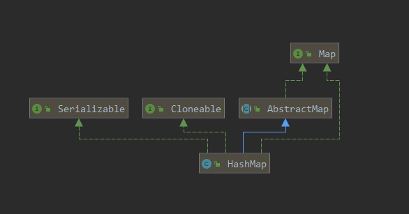
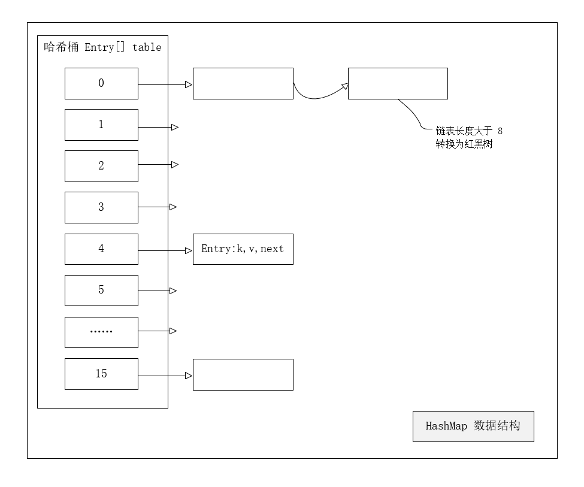

[TOC]


# 1.HashMap底层原理

## 1.1 HashMap的UML



- HashMap继承了AbstractMap；
- HashMap实现了Cloneable接口，支持克隆；
- HashMap实现了Serializable接口，支持序列化；

## 1.2 HashMap的数据结构

​		HashMap底层的数据是数组，被称为哈希桶，每个桶存放的是链表，链表中的每个节点，就是HashMap中的每个元素。综合起来HashMap数据结构=**数组+链表+红黑树**。



### 1.2.1 为什么用数组+链表？

- **数组**用来确定元素所在桶位置，利用元素的key的hash值对数组长度取模得到。
- **链表**用来解决hash冲突，当出现hash值一样的情形时，在数组对应位置形成一条链表。

## 1.3 HashMap源码中的常量、变量

```java
/**
     * 默认初始容量（必须是2的幂）
     */
    static final int DEFAULT_INITIAL_CAPACITY = 1 << 4; // aka 16

    /**
     * 最大容量（2的30次方）
     */
    static final int MAXIMUM_CAPACITY = 1 << 30;

    /**
     * 默认加载因子
     */
    static final float DEFAULT_LOAD_FACTOR = 0.75f;

    /**
     * 链表转换为红黑树的阈值
     */
    static final int TREEIFY_THRESHOLD = 8;

    /**
     * 树的链表还原阈值
     */
    static final int UNTREEIFY_THRESHOLD = 6;

    /**
     * 哈希表的最小树形化容量
     */
    static final int MIN_TREEIFY_CAPACITY = 64;
```

### 1.3.1 HashMap默认初始化容量（DEFAULT_INITIAL_CAPACITY）为什么是2的幂?

​		在HashMap的存取方法中，需要对元素所在数组索引位置进行定位，在`put()`方法中有`i = (n - 1) & hash`，在`get()`方法中有`(n - 1) & hash`（put()、get()详情在后面），索引公式为`(n - 1) & hash`，当初始化容量n大小是2的幂时，索引公式等价于`n%hash`。定位下标一般用取余法，这里为什么不用取余呢？

- 与运算（&）比取余（%）运算效率高；

- 求余运算： a % b就相当与a-(a / b)*b 的运算；

- 与运算： 一个指令就搞定

  所以，默认初始化容量大小定义为16，也就是2的幂，是为了使用更高效的与运算。

​	     还有一个原因就是在进行hash之后的位运算时，2的幂能保证计算的位数都是1，这样最终的下标就完全由key的hash值来决定也就更好的解决了hash碰撞。

### 1.3.2 HashMap默认初始化容量（DEFAULT_INITIAL_CAPACITY）为什么是16？

​		未论证：之所以取16是对效率和内存的一个平衡，如果太小，扩容会更频繁，如果太大，又会多占用内存空间。

参考：[Choosing the hash map's capacity](https://pzemtsov.github.io/2015/12/14/choosing-the-hash-maps-capacity.html)

### 1.3.3 HashMap的最大容量（MAXIMUM_CAPACITY）为什么是1 << 30 ?

​		int占4字节*一个字节占8位=32位整型，在二进制数中，最左边一位是符号位，用来表示正负，所以HashMap最大容量是1 << 30，而不是31次方或32次方。

### 1.3.4 HashMap的默认加载因子（DEFAULT_LOAD_FACTOR）为什么是0.75f ？

```java
 * <p>As a general rule, the default load factor (.75) offers a good
 * tradeoff between time and space costs.  Higher values decrease the
 * space overhead but increase the lookup cost (reflected in most of
 * the operations of the <tt>HashMap</tt> class, including
 * <tt>get</tt> and <tt>put</tt>).  The expected number of entries in
 * the map and its load factor should be taken into account when
 * setting its initial capacity, so as to minimize the number of
 * rehash operations.  If the initial capacity is greater than the
 * maximum number of entries divided by the load factor, no rehash
 * operations will ever occur.
 *
译文：通常，默认负载因子（.75）在时间和空间成本之间提供了一个很好的折衷方案。 较高的值会减少空间开销，但会增加查找成本（在HashMap类的大多数操作中都得到体现，包括get和put）。 设置映射表的初始容量时，应考虑映射中的预期条目数及其负载因子，以最大程度地减少重新哈希操作的数量。 如果初始容量大于最大条目数除以负载因子，则将不会进行任何哈希操作。
     
```

​	加载因子表示哈希表的填满程度，和HashMap的扩容紧密相关，根据HashMap源码中的文档（如上）可知，之所以选择0.75f作为默认加载因子，是`between time and space`在时间成本和空间成本上取的一个相对折中的方案。

​	有一种解释是根据数学公式来推测的，一个桶空和非空的概率为0.5，通过牛顿二项式等数学计算，得到这个加载因子的值为`log(2)≈0.693`，而最后选择0.75也许是因为0.75是较为接近这个结果且和默认容量相乘为一个整数12（1`6*0.75=12`）

​	下面这个假设推导大佬们可以看看：

`让s代表大小，n代表增加的键数。使用二项式定理，存储桶为空的概率为：`
$$
P(0) = C(n, 0) * (1/s)^0 * (1 - 1/s)^(n - 0)
$$
`因此，如果少于`
$$
log(2)/log(s/(s - 1)) keys
$$
`随着s达到无穷大，并且如果添加的键数达到P（0）= .5，则n / s迅速接近log（2）：`
$$
lim (log(2)/log(s/(s - 1)))/s as s -> infinity = log(2) ~ 0.693...
$$
参考：[What is the significance of load factor in HashMap?](https://stackoverflow.com/questions/10901752/what-is-the-significance-of-load-factor-in-hashmap)

### 1.3.5 链表转换红黑树的阀值（TREEIFY_THRESHOLD）为什么是8？

```java
    * Because TreeNodes are about twice the size of regular nodes, we
     * use them only when bins contain enough nodes to warrant use
     * (see TREEIFY_THRESHOLD). And when they become too small (due to
     * removal or resizing) they are converted back to plain bins.  In
     * usages with well-distributed user hashCodes, tree bins are
     * rarely used.  Ideally, under random hashCodes, the frequency of
     * nodes in bins follows a Poisson distribution
     * (http://en.wikipedia.org/wiki/Poisson_distribution) with a
     * parameter of about 0.5 on average for the default resizing
     * threshold of 0.75, although with a large variance because of
     * resizing granularity. Ignoring variance, the expected
     * occurrences of list size k are (exp(-0.5) * pow(0.5, k) /
     * factorial(k)). The first values are:
     *
     * 0:    0.60653066
     * 1:    0.30326533
     * 2:    0.07581633
     * 3:    0.01263606
     * 4:    0.00157952
     * 5:    0.00015795
     * 6:    0.00001316
     * 7:    0.00000094
     * 8:    0.00000006
     * more: less than 1 in ten million
```

`“`

​	理想情况下，在随机哈希码情况下，对于随机0.75的加载因子，桶中节点的分布频率服从参数为0.5的泊松分布，即使粒度调整会产生较大方差。

​	由源码中给出如上的参照表可知，当链表中元素个数为8时概率已经非常小了，所以链表转换红黑树的阈值选择了8。	

`”`

### 1.3.6 一个树的链表还原阈值（UNTREEIFY_THRESHOLD）为什么是6？

​		为了防止链表和树之间频繁的转换，如果是7的话，假设一个HashMap在临界点7频繁的插入和删除元素，链表中元素个数始终在`[7,8]`中徘徊，就会造成树和链表频繁的转换，降低HashMap操作的效率。

### 1.3.7 哈希表的最小树形化容量（MIN_TREEIFY_CAPACITY）为什么是64？

​		容量低于64时，哈希碰撞的几率比较大，而这个时候出现长链表的可能性会稍微大一些，这种原因下产生的长链表，应该优先选择扩容而避免不必要的数化。

参考：[面试加分项-HashMap源码中这些常量的设计目的-FROM掘金-Jay_huaxiao](https://juejin.im/post/5d7195f9f265da03a6533942#heading-0)


